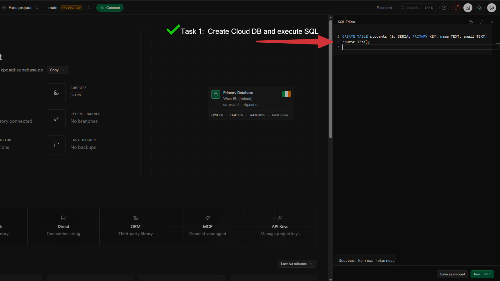
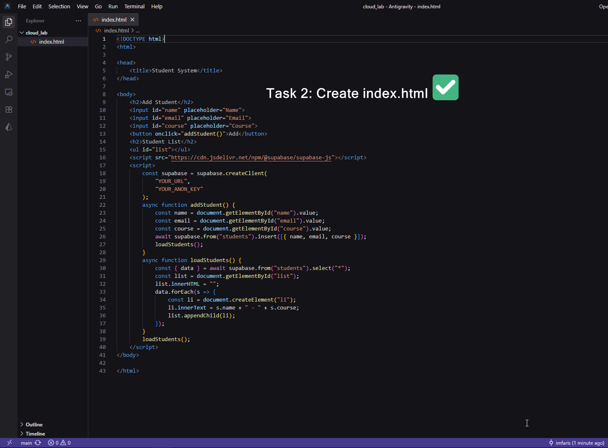
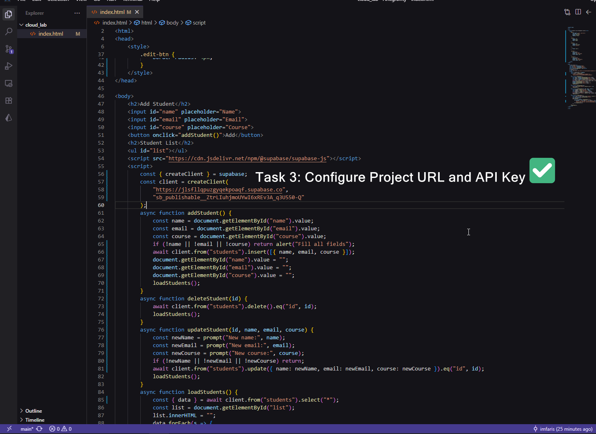
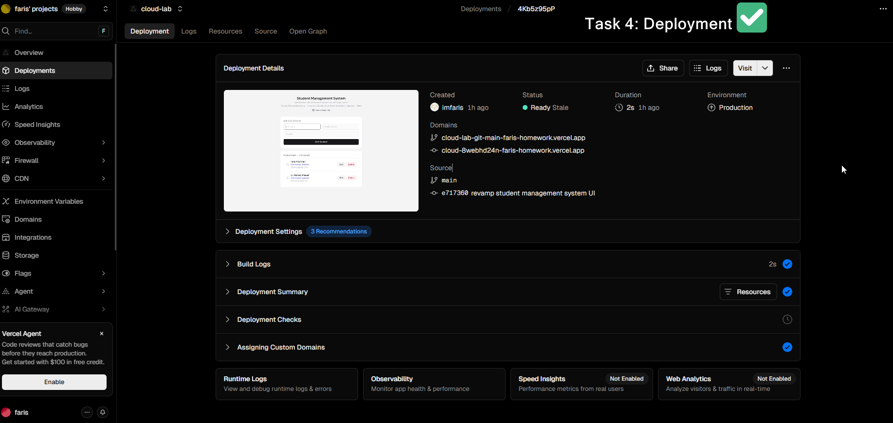

# Student Course Management System

A cloud-based web application developed for the Distributed Systems course lab exercise. 

**Live Demo:** [https://cloud-lab-mauve.vercel.app/](https://cloud-lab-mauve.vercel.app/)

## Lab Details
- **Course:** Distributed Systems
- **Topic:** Cloud Databases and Web Application Integration

## Lab Tasks Completed
1. **Task 1: Create Cloud DB and Execute SQL**
   Set up the cloud database in Supabase and create the students table using SQL.
    

2. **Task 2: Create index.html**
   Build the basic student management page structure with HTML and JavaScript.
    

3. **Task 3: Configure Project URL and API Key**
   Connect the web app to Supabase by adding the project URL and API key.
    

4. **Task 4: Deployment**
   Deploy the finished project and verify that the application is running successfully online.
    

## Features
- **Add Students:** Register new students with their name, email, and course.
- **View Students:** Display a paginated list of all registered students.
- **Update Records:** Edit existing student information directly from the list.
- **Delete Records:** Remove students from the system.
- **Cloud Database:** All data is persistently stored using Supabase.

## Tech Stack
- **Frontend:** HTML, Vanilla CSS, JavaScript
- **Database:** Supabase
- **Hosting:** Vercel